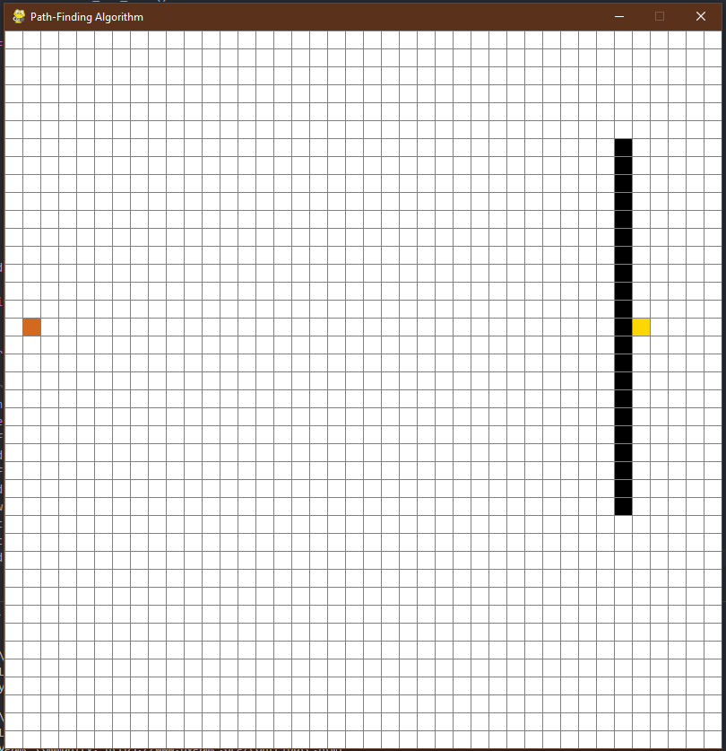
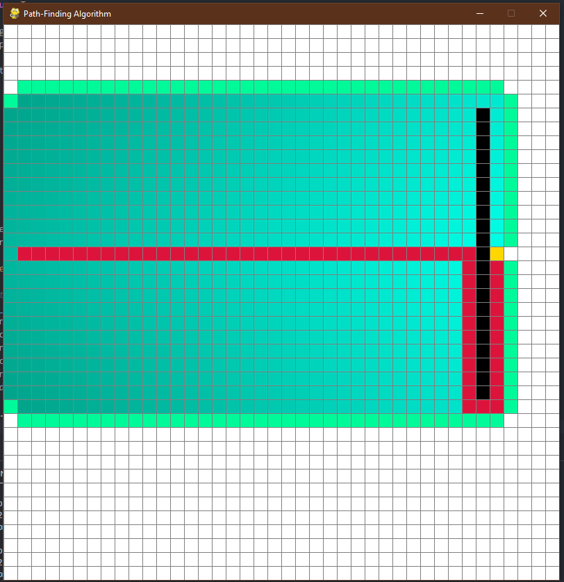
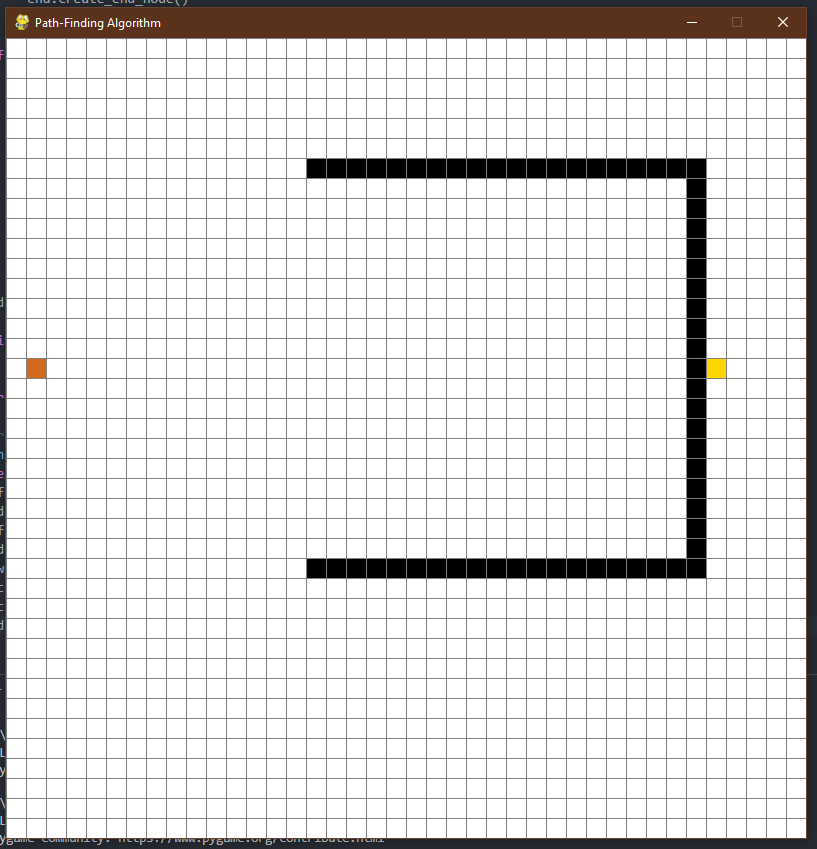
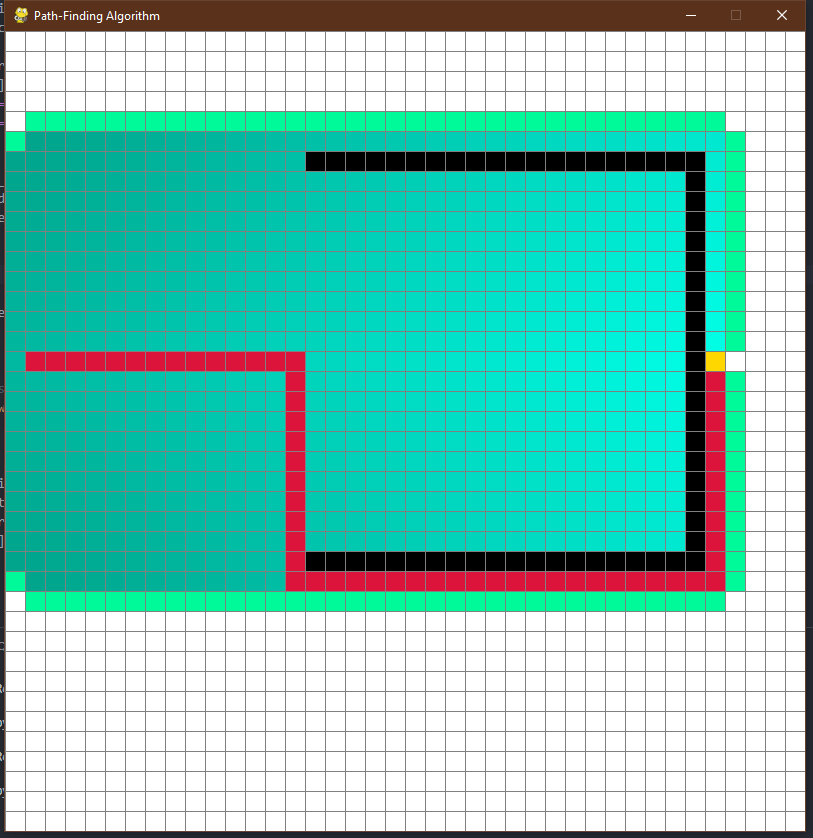
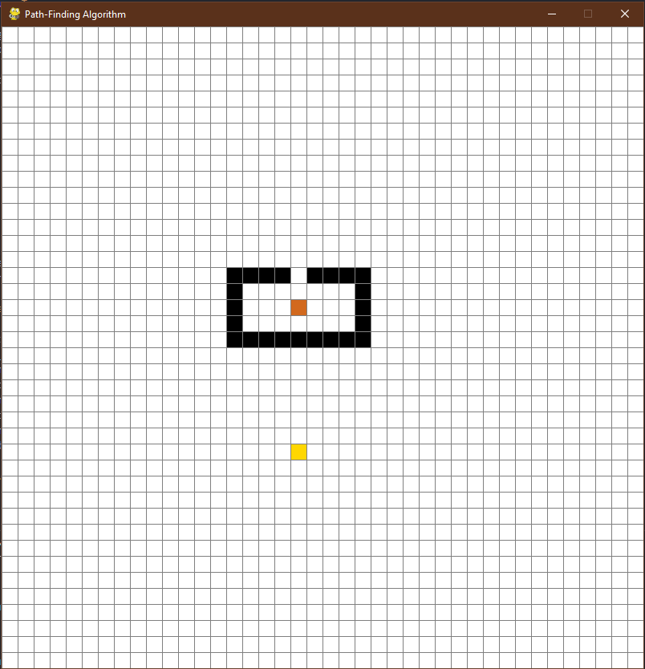
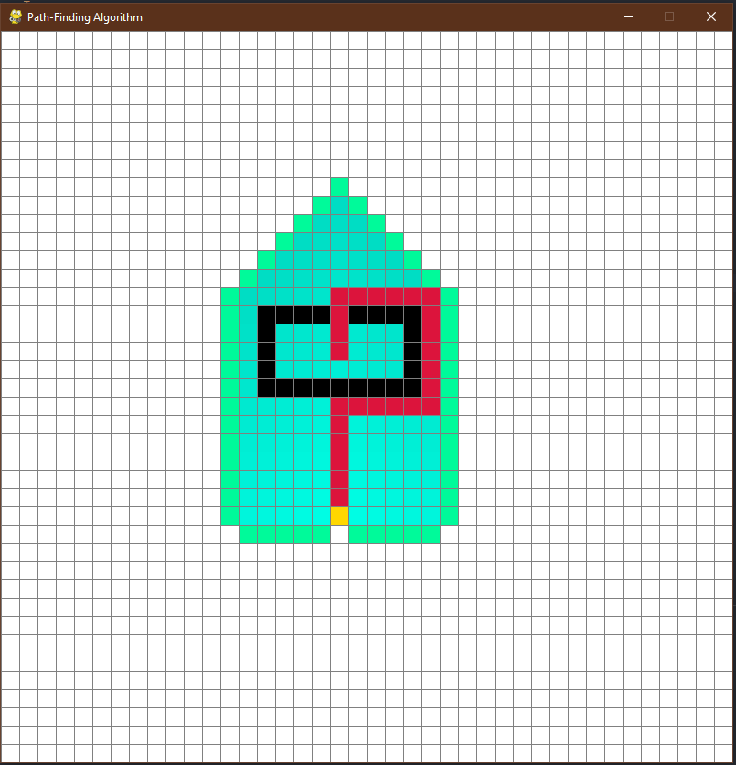

# Visualized-Pathfinding-GUI
Path-Finding with visual representation and Graphical-User-Interface used to find the shortest path between two points using the A* Algorithm 

_________________________________________________________________________________________________________________________________________________
𝐊𝐞𝐲:

Start Node:   

End Node:   

Barrier Node:   

Path:   

Far Node:  #node that is far from the end node (High Heuristic Value)  

Close Node:  #node that is close from the end node (Low Heuristic Value)  

_________________________________________________________________________________________________________________________________________________
𝐓𝐞𝐬𝐭 𝐂𝐚𝐬𝐞𝐬:

Test Case 1: Simple test case with a simple barrier  
  

Result:  
  

Test Case 2: Concave Barrier (greedy path finding would have not given a shortest path for this test case)  
  

Result:  
  

Test Case 3: Surrounding Barrier (no paths available)  
  

Result:  
  

